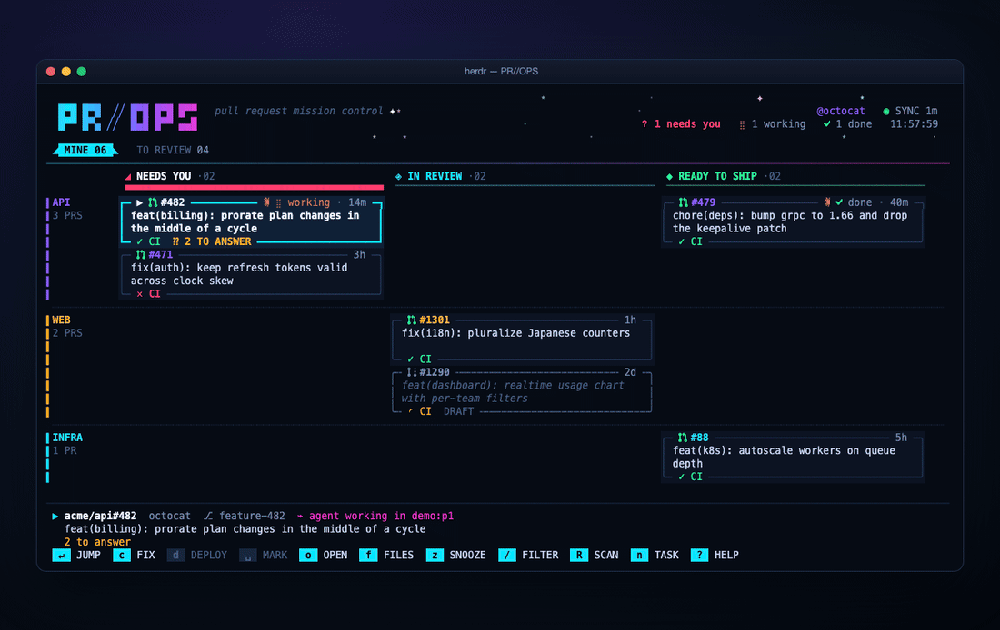
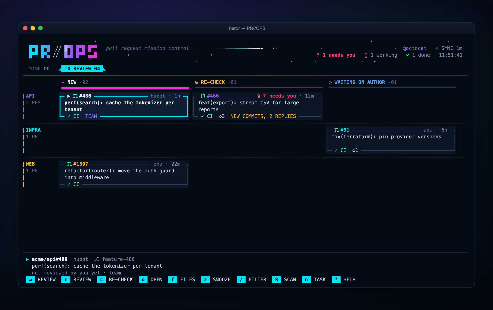
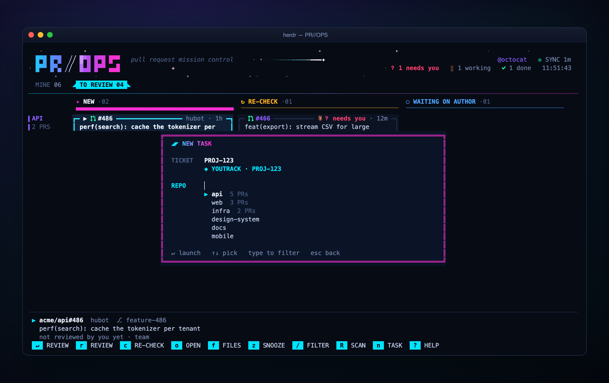

<div align="center">

# PR//OPS

**Pull request mission control for [Herdr](https://herdr.dev)**

Your pull requests and review requests on one board, in a popup over your
panes. One key starts a coding agent to review, re-check or ship a PR, in its
own Herdr pane.



</div>

## Why

GitHub tabs pile up: your open PRs, the ones approved and waiting to ship, the
ones teammates asked you to review, and the ones where you need to check
whether your comments were addressed. PR//OPS puts all of them on one board
inside Herdr, shows which ones need you, and starts the agent that handles
each one in the right checkout.

## What you get

- **Two boards, columns by state, swimlanes by repo.**

  | tab | columns |
  |---|---|
  | **Mine** | Needs you (changes requested, comments to answer, CI failed, conflict) → In review → Ready to ship |
  | **To review** | New → Re-check (new commits, replies on your threads, or re-requested since your last review) → Waiting on author |

- **One key does the obvious thing.** `enter` jumps to the PR's agent, or
  starts the right one: a review, a re-check, or a report-only status check
  of your own PR. `r` reviews, `c` re-checks (or, on your own PR, fixes
  feedback, CI and conflicts), `d` ships approved PRs,
  `n` starts an agent on a YouTrack ticket or Sentry issue. Every prompt is
  yours to configure.
- **Agents on the board.** Each card shows the agent working on that PR,
  herdr-radar style: spinner while working, a pulsing `?` when it waits on
  you, `✓` when done. Agents you started by hand count too, matched by their
  title, their folder's branch and, for Claude Code, the PR URLs, worktree
  paths, branches and ticket IDs in their recent session. `enter` jumps to the
  agent's pane.
- **Notifications** for new review requests, PRs to re-check, and approvals,
  change requests, CI failures, conflicts and questions on your PRs.
- **Cheap on the GitHub API.** A light scan every 3 minutes costs about one
  GraphQL point; full detail is fetched only for PRs that changed.
- **No dependencies.** Node 18+ and the GitHub CLI.

<table>
<tr>
<td></td>
<td></td>
</tr>
<tr>
<td align="center"><sub>To review: new, re-check, waiting on author</sub></td>
<td align="center"><sub><code>n</code>: start an agent on a ticket</sub></td>
</tr>
</table>

## Install

Requirements: [Herdr](https://herdr.dev) 0.9+, Node 18+, and an authenticated
[GitHub CLI](https://cli.github.com) (`gh auth login`).

```sh
herdr plugin install tferreira/herdr-pr-ops
```

Bind the board to a key in `~/.config/herdr/config.toml`, then run
`herdr server reload-config`:

```toml
[[keys.command]]
key = "prefix+d"
type = "plugin_action"
command = "tferreira.herdr-pr-ops.open"
description = "PR//OPS"
```

Want to look around first? `herdr plugin action invoke tferreira.herdr-pr-ops.demo`
opens the board with fake data; nothing is fetched or launched.

## Keys

| key | action |
|---|---|
| `←→↑↓` (or `hjkl`) | move between columns and PRs |
| `tab`, `1`, `2` | switch Mine / To review |
| `r` | review: new agent in a worktree at the PR head |
| `c` | To review: were your comments addressed? Mine: get the PR ready (fix feedback, CI, conflicts; draft replies). Reuses an idle agent already on the PR |
| `d` | ship an approved PR (CI green, nothing to answer, no conflict), or every marked PR |
| `space`, alt+click | mark a ready PR for a multi-ship; marks are numbered in shipping order, `esc` clears them |
| `enter` | jump to the PR's agent. No agent yet: review a new PR, re-check one with news since your review, or on your own PR a report-only status check (feedback, CI, conflicts). Does nothing on PRs waiting on their author |
| `o` / `f` | open the PR / its changed files in the browser |
| `y` | copy the PR URL |
| `z` / `s` | snooze until the PR changes / show snoozed |
| `n` | new task from a YouTrack ticket or Sentry issue |
| `/` | filter by repo, title or author |
| `R`, `F5` | full rescan |
| `,` | settings: edit `config.json` in `$EDITOR` |
| `?` | help |
| `q`, `esc` | close |

Alt+click a card to mark it (Herdr popups keep plain clicks and the wheel
for themselves). The bottom bar always shows the keys that apply to the
selected PR.

## How agents are started

- **Reviews** (`r`, `c`) fetch `refs/pull/<N>/head` into a branch `pr-<N>` and
  open it as a Herdr worktree next to your clone (`<clone>-pr<N>`), so your
  own checkout is never touched. A re-check moves a clean review worktree to
  the new head and reuses the agent if it is still open.
- **Your own PRs** (`enter` for a status report, `c` to fix) prompt the agent
  already on the PR when it is idle; otherwise they open your existing
  checkout of the PR's branch (fast-forwarded to origin when clean) or a new
  worktree of it. The status check only reports; the fix shows you
  everything before committing, pushing or posting.
- **Ships** (`d`) open a tab in the repo's workspace. Marked PRs ship
  together: one agent per repo, given all of that repo's PRs in marking order
  (`{url}` and `{urls}` hold the space-separated URLs).
- **Tasks** (`n`) create a worktree on a branch named after the ticket, from
  the remote default branch, and ask the agent for a plan before any code.
  Ctrl+click a YouTrack or Sentry issue link in any Herdr pane to open the
  task box prefilled.

Local clones are found as `<repoRoot>/<repo name>`; without one, the agent
starts in your home directory and works from `gh`.

## Settings

Press `,` on the board, or edit
`$(herdr plugin config-dir tferreira.herdr-pr-ops)/config.json`. Every key is
optional and changes apply on the next scan.

```json
{
  "orgs": ["acme"],
  "excludeRepos": ["acme/legacy"],
  "repoRoots": ["~/code"],
  "repos": { "acme/api": "~/work/api" },
  "pollSeconds": 180,
  "agentKind": "claude",
  "glyphs": "auto",
  "worktreePath": "{repo}-pr{number}",
  "taskWorktreePath": "{repo}-{slug}",
  "youtrackUrl": "https://acme.youtrack.cloud",
  "sentryOrg": "acme",
  "sentryProjects": { "frontend": "web" },
  "prompts": {
    "review": "/my-review-skill {url}",
    "recheck": "Were my review comments on {url} addressed? ...",
    "status": "Check the status of my pull request {url} and report only. ...",
    "address": "Get my pull request {url} ready. ...",
    "deploy": "/release {url}",
    "youtrack": "Work on YouTrack ticket {id}{urlNote}. ...",
    "sentry": "Investigate Sentry issue {id}{urlNote}. ..."
  }
}
```

| key | default | |
|---|---|---|
| `orgs` | all | only PRs from these GitHub orgs |
| `excludeRepos` | none | `owner/name` repos to hide |
| `repoRoots` | `~/code`, `~/src`, `~/projects`, `~/repos`, `~/git`, `~/dev` | where clones live |
| `repos` | | explicit `owner/name` → path |
| `pollSeconds` | `180` | scan interval |
| `agentKind` | `claude` | any [Herdr agent kind](https://herdr.dev) |
| `glyphs` | `auto` | `font` uses [herdr-radar](https://github.com/hhdebb/herdr-radar)'s icon font and Nerd Font icons, `text` plain Unicode, `auto` picks `font` when herdr-radar is installed |
| `prompts.*` | plain-language prompts, no skills needed | point them at your own skills or slash commands. PR prompts get `{url}` `{urls}` `{repo}` `{number}`, task prompts `{id}` `{url}` `{urlNote}` |

The default prompts are plain instructions any agent can follow: reviews and
re-checks work through `gh`, ships follow the release process the agent finds
in the repo (README, CONTRIBUTING, CLAUDE.md, CI config) and always ask before
merging, and tickets use the agent's YouTrack or Sentry tools (MCP) or ask you
to paste the ticket. If you have skills or slash commands for these, point the
prompts at them, e.g. `"review": "/my-review {url}"`.

YouTrack and Sentry short IDs look alike (`PROJ-123`, `API-1A`). A prefix that
matches a repo name or a `sentryProjects` key is read as Sentry, otherwise
YouTrack; `tab` in the task box flips it.

## Rules worth knowing

- **To answer** counts open review threads where someone else spoke last,
  plus top-level comments and comment-only reviews from others since your
  last push, comment or review. Bots are ignored.
- **CircleCI approval jobs** waiting "on hold" count as passing CI.
- PRs you approved leave To review unless you are re-requested.

## Development

```sh
herdr plugin link /path/to/herdr-pr-ops
node bin/dashboard.js --demo                       # the board with fake data
node bin/dashboard.js --demo --snapshot 150x36 mine   # print one frame
sh tools/screenshots.sh                            # regenerate assets/
```

| file | |
|---|---|
| `bin/dashboard.js` | the board |
| `bin/daemon.js` | poller and notifications |
| `bin/launch.js` | worktrees, panes and agents |
| `bin/open.js` | actions and startup hook |
| `lib/github.js` | GraphQL queries and column rules |
| `lib/tickets.js` | ticket parsing, local repo discovery |
| `lib/header.js` | the animated logo band |
| `lib/marks.js` | agent marks |
| `lib/gitinfo.js` | repo and branch of a directory |
| `lib/agentlink.js` | which PR each agent is working on |

## License

MIT
