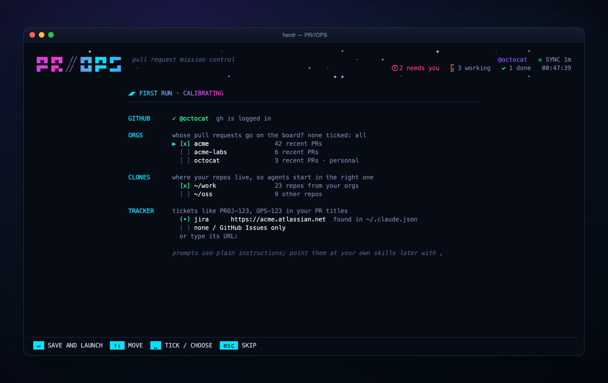

<div align="center">

# PR//OPS

**Pull request mission control for [Herdr](https://herdr.dev)**

Your pull requests and review requests on one board, in a popup over your
panes. One key starts a coding agent to review, re-check or ship a PR, in its
own Herdr pane.


</div>

## Why

GitHub tabs pile up: your open PRs, the ones approved and waiting to ship, the
ones teammates asked you to review, and the ones where you need to check
whether your comments were addressed. PR//OPS puts all of them on one board
inside Herdr, shows which ones need you, and starts the agent that handles
each one in the right checkout.

## What you get

- **Two boards, columns by state, swimlanes by repo.**

  | tab | columns |
  |---|---|
  | **Mine** | In progress (agents on a branch with no PR yet) → Needs you (changes requested, comments to answer, CI failed, conflict) → In review → Ready to ship |
  | **To review** | New → Re-check (re-requested, replies in your threads, or new commits after you requested changes or while your review request is still open) → Waiting on author |

- **One key does the obvious thing.** `enter` jumps to the PR's agent, or
  starts the right one: a review, a re-check, or a report-only status check
  of your own PR. `r` reviews, `c` re-checks (or, on your own PR, fixes
  feedback, CI and conflicts), `d` ships approved PRs,
  `n` starts an agent on a GitHub, Jira, Linear, YouTrack or Sentry issue.
  Every prompt is
  yours to configure.
- **Agents on the board.** Each card shows the agent working on that PR,
  herdr-radar style: spinner while working, a pulsing `?` when it waits on
  you, `✓` when done. Agents you started by hand count too, matched by their
  title, their folder's branch and, for Claude Code, the PR URLs, worktree
  paths, branches and ticket IDs in their recent session. `enter` jumps to the
  agent's pane.
- **Notifications** for new review requests, PRs to re-check, and approvals,
  change requests, CI failures, conflicts and questions on your PRs.
- **Cheap on the GitHub API.** A light scan every 3 minutes costs about one
  GraphQL point; full detail is fetched only for PRs that changed.
- **No dependencies.** Node 18+ and the GitHub CLI.

<table>
<tr>
<td></td>
<td></td>
</tr>
<tr>
<td align="center"><sub>To review: new, re-check, waiting on author</sub></td>
<td align="center"><sub><code>n</code>: start an agent on a ticket</sub></td>
</tr>
</table>

## Install

Requirements: [Herdr](https://herdr.dev) 0.9+, Node 18+, and an authenticated
[GitHub CLI](https://cli.github.com) (`gh auth login`).

```sh
herdr plugin install tferreira/herdr-pr-ops
```

The install binds the board to `prefix+d` (`prefix+alt+d` if that is taken)
in a marked block at the end of Herdr's `config.toml`, and leaves the file
alone if you already bound it. To pick your own key, run
`herdr plugin action invoke tferreira.herdr-pr-ops.remove-keybinding` and add:

```toml
[[keys.command]]
key = "prefix+alt+p"
type = "plugin_action"
command = "tferreira.herdr-pr-ops.open"
description = "PR//OPS"
```

Press `prefix+d`. The first time, a setup screen finds what it can by itself
and you mostly press `enter`:

- **orgs:** the owners of PRs you were involved in lately; the busiest one is
  ticked, personal and side orgs are not;
- **clones:** folders under `~` holding clones from those orgs, so agents
  start in the right repo;
- **tracker:** a Jira, Linear or YouTrack URL your coding agent is already
  connected to (its MCP config), or one you type.

It only reads `gh`, your folders and your agent config files, and writes the
plugin's `config.json`. Change anything later with `,` on the board, or run
the setup again with `herdr plugin action invoke tferreira.herdr-pr-ops.setup`.
Every setting is in [Settings](#settings).



Want to look around first? `herdr plugin action invoke tferreira.herdr-pr-ops.demo`
opens the board with fake data; nothing is fetched or launched.

Update by running the install command again (see [CHANGELOG.md](CHANGELOG.md)
for what changed); remove with the `remove-keybinding` action, then
`herdr plugin uninstall tferreira.herdr-pr-ops`.

## Keys

| key | action |
|---|---|
| `←→↑↓` (or `hjkl`) | move between columns and PRs |
| `tab`, `1`, `2` | switch Mine / To review |
| `r` | review: new agent in a worktree at the PR head |
| `c` | To review: were your comments addressed? Mine: get the PR ready (fix feedback, CI, conflicts; draft replies). Reuses an idle agent already on the PR |
| `d` | ship an approved PR (CI green, nothing to answer, no conflict), or every marked PR |
| `space`, alt+click | mark a ready PR for a multi-ship; marks are numbered in shipping order, `esc` clears them |
| `x` `x` | stop the card's agent (press twice). The PR stays on the board; see below for what is cleaned up |
| `enter` | jump to the PR's agent. No agent yet: review a new PR, re-check one with news since your review, or on your own PR a report-only status check (feedback, CI, conflicts). Does nothing on PRs waiting on their author |
| `o` / `f` | open the PR / its changed files in the browser |
| `y` | copy the PR URL |
| `z` / `s` | snooze until the PR changes / show snoozed |
| `n` | new task from a ticket: GitHub, Jira, Linear, YouTrack or Sentry (`tab` picks the tracker for a bare `PROJ-123`) |
| `/` | filter by repo, title or author |
| `R`, `F5` | full rescan |
| `,` | settings: edit `config.json` in `$EDITOR` |
| `m` | screen mode: remote screen (`herdr --remote`) / this screen |
| `?` | help |
| `q`, `esc` | close |

Alt+click a card to mark it (Herdr popups keep plain clicks and the wheel
for themselves). The bottom bar always shows the keys that apply to the
selected PR; when `enter` does the same as `r` or `c`, they share a chip
(`↵ r REVIEW`).

## How agents are started

- **Reviews** (`r`, `c`) fetch `refs/pull/<N>/head` into a branch `pr-<N>` and
  open it as a Herdr worktree next to your clone (`<clone>-pr<N>`), so your
  own checkout is never touched. A re-check moves a clean review worktree to
  the new head and reuses the agent if it is still open.
- **Your own PRs** (`enter` for a status report, `c` to fix) prompt the agent
  already on the PR when it is idle; otherwise they open your existing
  checkout of the PR's branch (fast-forwarded to origin when clean) or a new
  worktree of it. The status check only reports; the fix shows you
  everything before committing, pushing or posting.
- **Stopping** (`x` twice) closes the agent's pane, or its tab when it is
  the only pane (Herdr closes a workspace with its last tab). A clean review
  worktree (`pr-<N>`) is removed too; its branch stays. Task and fix
  worktrees hold your work and are never removed, nor are main clones.
- **Ships** (`d`) open a tab in the repo's workspace. Marked PRs ship
  together: one agent per repo, given all of that repo's PRs in marking order
  (`{url}` and `{urls}` hold the space-separated URLs).
- **Tasks** (`n`) create a worktree on a branch named after the ticket, from
  the remote default branch, and ask the agent for a plan before any code.
  Ctrl+click an issue link (GitHub, Jira Cloud, Linear, YouTrack Cloud,
  Sentry) in any Herdr pane to open the task box prefilled.

Fetches go over HTTPS with `gh`'s token, so they work without an SSH agent
and despite `url.<ssh>.insteadOf` rewrites. Local clones are found as
`<repoRoot>/<repo name>`; without one, the agent
starts in your home directory and works from `gh`.

## Settings

Press `,` on the board, or edit
`$(herdr plugin config-dir tferreira.herdr-pr-ops)/config.json`. Every key is
optional and changes apply on the next scan.

```json
{
  "orgs": ["acme"],
  "excludeRepos": ["acme/legacy"],
  "repoRoots": ["~/code"],
  "repos": { "acme/api": "~/work/api" },
  "pollSeconds": 180,
  "agentKind": "claude",
  "glyphs": "auto",
  "worktreePath": "{repo}-pr{number}",
  "taskWorktreePath": "{repo}-{slug}",
  "jiraUrl": "https://acme.atlassian.net",
  "linearUrl": "https://linear.app/acme",
  "youtrackUrl": "https://acme.youtrack.cloud",
  "defaultTracker": "jira",
  "sentryOrg": "acme",
  "sentryProjects": { "frontend": "web" },
  "trackers": [
    { "name": "shortcut", "label": "Shortcut story",
      "urlPattern": "^https://app\\.shortcut\\.com/[^/]+/story/(\\d+)",
      "idPattern": "^sc-\\d+$", "link": "https://app.shortcut.com/acme/story/{id}" }
  ],
  "prompts": {
    "review": "/my-review-skill {url}",
    "recheck": "Were my review comments on {url} addressed? ...",
    "status": "Check the status of my pull request {url} and report only. ...",
    "address": "Get my pull request {url} ready. ...",
    "deploy": "/release {url}",
    "ticket": "Work on {label} {id}{urlNote}. ...",
    "github": "Work on GitHub issue {id}{urlNote}. ...",
    "sentry": "Investigate Sentry issue {id}{urlNote}. ..."
  }
}
```

| key | default | |
|---|---|---|
| `orgs` | all | only PRs from these GitHub orgs |
| `excludeRepos` | none | `owner/name` repos to hide |
| `repoRoots` | `~/code`, `~/src`, `~/projects`, `~/repos`, `~/git`, `~/dev` | where clones live |
| `repos` | | explicit `owner/name` → path |
| `pollSeconds` | `180` | scan interval |
| `openLinks` | `auto` | `o` / `f`: `browser`, `copy` (OSC 52 to your terminal's clipboard), or `auto` (copy over SSH or without a display) |
| `agentKind` | `claude` | any [Herdr agent kind](https://herdr.dev) |
| `glyphs` | `auto` | `font` uses [herdr-radar](https://github.com/hhdebb/herdr-radar)'s icon font and Nerd Font icons, `text` plain Unicode, `auto` picks `font` when herdr-radar is installed |
| `prompts.*` | plain-language prompts, no skills needed | point them at your own skills or slash commands. PR prompts get `{url}` `{urls}` `{repo}` `{number}`, task prompts `{id}` `{url}` `{urlNote}` |

The default prompts are plain instructions any agent can follow: reviews and
re-checks work through `gh`, ships follow the release process the agent finds
in the repo (README, CONTRIBUTING, CLAUDE.md, CI config) and always ask before
merging, and tickets use `gh` for GitHub issues and the agent's own tools
(MCP) for other trackers, or ask you to paste the ticket. If you have skills or slash commands for these, point the
prompts at them, e.g. `"review": "/my-review {url}"`.

### Trackers

| tracker | recognised | branch / worktree |
|---|---|---|
| GitHub | `https://github.com/o/r/issues/12`, `o/r#12` | `issue-12`, `<clone>-issue12` |
| Jira | any `…/browse/PROJ-12` URL | `PROJ-12`, `<clone>-proj12` |
| Linear | `https://linear.app/<team>/issue/ENG-12…` | `ENG-12`, `<clone>-eng12` |
| YouTrack | any `…/issue/PROJ-12` URL | `PROJ-12`, `<clone>-proj12` |
| Sentry | `…sentry.io/issues/123`, short IDs like `API-1A` | `API-1A`, `<clone>-1a` |
| yours | `trackers` entries: `urlPattern` (group 1 = id), `idPattern`, `link` (`{id}`), `prompt` | |

A bare `PROJ-123` could be Jira, Linear or YouTrack: it goes to
`defaultTracker`, or the first of those whose base URL you set, and `tab` in
the task box cycles through the alternatives. A key whose prefix is a repo
name or a `sentryProjects` key reads as a Sentry short ID. Each tracker uses
`prompts.<name>` when set, else `prompts.ticket` (`{label}`, `{id}`, `{url}`,
`{urlNote}`).

## Remote machines (`herdr --remote`)

Install PR//OPS only on the machine that runs the Herdr server, with Node,
`gh`, your clones and your agent. The machine you attach from needs no
plugin: it only draws the board.

It does need one key binding. With `--remote`, Herdr uses the key bindings
of the machine you sit at, and the install only added `prefix+d` on the
server. Bind it on the attaching machine to `open-remote`: the same board,
but links (`o`, `f`, `y`) go to that machine's clipboard instead of opening a
browser on the server, and icons are plain text for terminals without
herdr-radar's font. The header shows `⇄ REMOTE SCREEN`.

Windows (PowerShell), once:

```powershell
New-Item -ItemType Directory -Force "$env:APPDATA\herdr" | Out-Null
Add-Content "$env:APPDATA\herdr\config.toml" "`n[[keys.command]]`nkey = `"prefix+d`"`ntype = `"plugin_action`"`ncommand = `"tferreira.herdr-pr-ops.open-remote`"`ndescription = `"PR//OPS`""
```

macOS or Linux:

```sh
printf '\n[[keys.command]]\nkey = "prefix+d"\ntype = "plugin_action"\ncommand = "tferreira.herdr-pr-ops.open-remote"\ndescription = "PR//OPS"\n' >> "${XDG_CONFIG_HOME:-$HOME/.config}/herdr/config.toml"
```

Then reattach (or use Herdr's reload-config action). Sitting at the server
machine, `prefix+d` keeps opening the normal board.

- No binding on the attaching machine? `herdr --remote <host>
  --remote-keybindings server` uses the server's `prefix+d`, and `m` on the
  board switches to remote-screen mode (remembered until you press it again).
- Over plain SSH or on a machine without a display, links are copied
  automatically; `"openLinks": "copy"` forces it.
- `"remote": { "openLinks": "copy", "glyphs": "text" }` changes what
  remote-screen mode does.

## Rules worth knowing

- **To answer** counts open review threads where someone else spoke last,
  plus top-level comments and comment-only reviews from others since your
  last push, comment or review. Bots are ignored.
- **CircleCI approval jobs** waiting "on hold" count as passing CI.
- PRs you approved leave To review unless you are re-requested.
- **In progress** holds work that has no PR yet: tasks started with `n`, and
  any agent sitting on a feature branch (not main/master) of a repo in your
  `orgs`. The card shows the ticket or branch and the agent's own title; once
  the agent opens a PR, the PR card takes over.
- A PR that leaves the lists (merged, closed, or approved by you) keeps its
  card in the last column, tagged `⛙ MERGED`, `✕ CLOSED` or `✓ YOU APPROVED`,
  while an agent is on it, so you can follow a deploy or a review to the end.
  It goes when the agent's pane closes, at most a day later.

## Development

```sh
herdr plugin link /path/to/herdr-pr-ops
node bin/dashboard.js --demo                       # the board with fake data
node bin/dashboard.js --demo --snapshot 150x36 mine   # print one frame
sh tools/screenshots.sh                            # regenerate assets/
```

| file | |
|---|---|
| `bin/dashboard.js` | the board |
| `bin/daemon.js` | poller and notifications |
| `bin/launch.js` | worktrees, panes and agents |
| `bin/open.js` | actions and startup hook |
| `bin/configure.js` | the key binding in Herdr's config.toml |
| `bin/stop.js` | stop an agent and tidy its tab or review worktree |
| `lib/github.js` | GraphQL queries and column rules |
| `lib/tickets.js` | trackers, ticket parsing, local repo discovery |
| `lib/header.js` | the animated logo band |
| `lib/marks.js` | agent marks |
| `lib/gitinfo.js` | repo and branch of a directory |
| `lib/agentlink.js` | which PR each agent is working on |

## Changes

See [CHANGELOG.md](CHANGELOG.md).

## License

MIT
